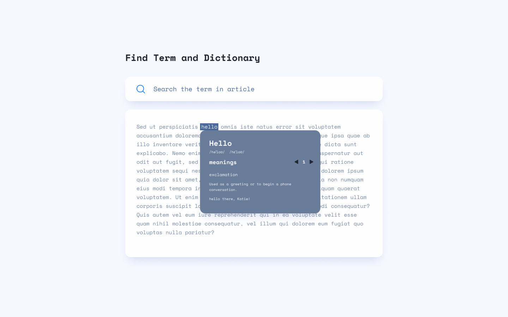

# Vue x Tailwind - Find Term and Dictionary

## 需求

1. 做出這個版型
2. 當使用者輸入字串搜尋時，會自動搜尋文章中所有符合的文字
3. 在第一個符合的文字下方，跳出字典 popup
4. 使用 [Free Dictionary API] 查詢搜尋到的文字

## 使用技術

-   Vue 3
-   Tailwind
-   Vite

## Reference

[Free Dictionary API](https://dictionaryapi.dev/)
